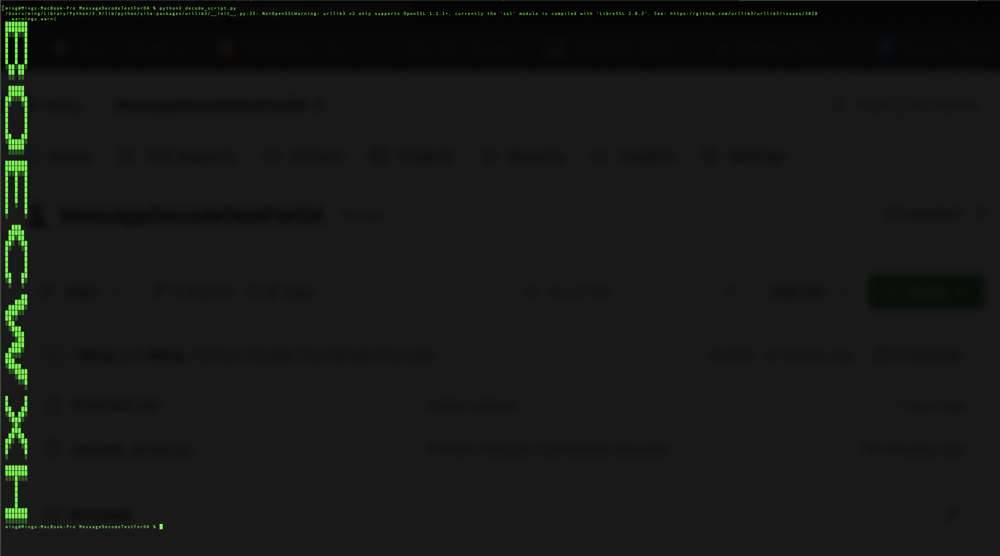

# interview-test-message-decoding-from-google-doc

Given the google doc content of [this url](https://docs.google.com/document/d/e/2PACX-1vTWqR8Ta9hDLj0vUXr3DyO470m1QMFbKdOGoTby36zjrZNpmSxAMzyPgW8NIFHBIAAeFjLwgWdHg2I8/pub")

It uses decode_script.py to generate this image using the coordinate data in the content of the google doc url.
